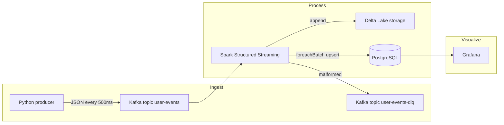

# Real-Time Streaming Pipeline — Step-by-Step Implementation

This plan maps your requirements to concrete phases. Stack assumptions: **local development on Docker**, **Spark 3.x** with **Scala 2.12 or 2.13** (pick one and stay consistent across packages), **Python 3.10+** for the producer, **PostgreSQL 15+** in Docker for Grafana.

---

## Architecture (target state)

**Latency budget:** producer interval (500 ms) + Spark trigger + batch write < 5 s → use a **short trigger** (e.g. `processingTime('2 seconds')` or `'1 second'`) and keep transformations bounded.

---

## Phase 1 — Kafka with Docker Compose

1. **Compose services:** ZooKeeper (or KRaft-only Kafka if you prefer modern images; single-broker + ZK matches your spec), one Kafka broker, expose `9092` (and `29092` for internal if using common bitnami/confluent patterns).
2. **Create topics** (after broker is healthy):
   - `user-events`: **3 partitions**, replication factor **1** (local).
   - `user-events-dlq`: 1–3 partitions for dead letters.
3. **Document** topic names and bootstrap server(s) in `.env` or README for producer and Spark.

**Checkpoint:** `kafka-console-consumer` can read messages you publish manually.

---

## Phase 2 — Python event producer (`confluent-kafka`)

1. **Dependencies:** `confluent-kafka`, optionally `faker` for synthetic fields.
2. **Message contract:** Define a **fixed JSON schema** (e.g. `event_id`, `timestamp`, `event_type`, `user_id`, `payload` / numeric sensor fields). Serialize with `json.dumps` before `produce()`.
3. **Throughput:** Sleep **500 ms** between events (or use a tight loop with `time.sleep(0.5)`).
4. **Robustness:** Set `acks='all'`, handle `poll()` for delivery callbacks, flush on shutdown.
5. **Optional second mode:** Wikimedia [EventStream](https://stream.wikimedia.org/?doc) via SSE — parse each event into **your same schema** so Spark stays unchanged (great demo for "real" data).

**Checkpoint:** Consumer shows steady JSON on `user-events`.

---

## Phase 3 — Spark Structured Streaming job

### Reading from Kafka

- Format: `kafka` with `subscribe` = `user-events`, `kafka.bootstrap.servers`, starting offsets **latest** for dev (or **earliest** for replay tests).
- Packages (submit command): include **`spark-sql-kafka-0-10`** and **`delta-spark`** matching your Spark version.

### Schema enforcement and DLQ

1. Define **`StructType`** matching the producer JSON.
2. Parse with `from_json(col("value").cast("string"), schema)`. Rows where parse fails → **filter** or use a **union** with a "bad" flag; write bad rows to Kafka **`user-events-dlq`** using a **`foreachBatch`** or a **second streaming query** that only forwards invalid records (keep DLQ logic simple: key = original bytes, value = error reason + payload).

### Transformations

- **Parsing:** timestamps to `timestamp` type; derive **watermark** if you use windows (e.g. `window(event_time, '1 minute')`).
- **Aggregations:** e.g. events per minute per `event_type`, error counts if you embed `status` / `success`.
- **Filtering:** drop noise as needed; ensure metrics for "errors" align with Grafana panels.

### Sink A — Delta Lake (append)

- Write stream: `format("delta")`, `outputMode("append")`, path on **local disk** or Docker volume, **`checkpointLocation`** set (required for recovery).
- Idempotent writes across restarts rely on checkpoint + Kafka offsets — **do not delete checkpoint** casually.

### Sink B — PostgreSQL (foreachBatch for Grafana)

- Use **`foreachBatch`** on the **aggregated** streaming dataframe (not raw events if you want manageable Postgres size): each micro-batch, use JDBC or `spark.write.jdbc` with **`overwrite`** staging table + SQL **merge/upsert**, or use **PostgreSQL `ON CONFLICT`** from a temp table.
- Table example: `(window_start, window_end, event_type, event_count, error_count, updated_at)` with **unique constraint** on `(window_start, event_type)`.

**Checkpoint:** Spark UI shows batches completing; Delta folder grows; Postgres rows update per batch.

---

## Phase 4 — PostgreSQL + Grafana

1. **Postgres** in Compose; create schema/table matching Spark upsert keys.
2. **Grafana:** Add Postgres datasource; build panels:
   - **Events/sec:** `rate` or derivative on counts over time windows from stored aggregates (or raw if you store second-level buckets).
   - **Error rate:** ratio from columns or separate series.
   - **Top event types:** bar/table with `ORDER BY count DESC LIMIT N` **per last window** (or use Grafana transformations).
3. **Dashboard:** Set **refresh = 5 s** (dashboard or panel level).

**Checkpoint:** Changing producer volume changes graphs within ~5 s without manual refresh.

---

## Phase 5 — Failure recovery (your success criterion)

1. **Spark:** Stop the streaming query abruptly (kill driver or Ctrl+C), **restart with same checkpoint path** and same topic — processing should resume from committed offsets.
2. **Kafka:** With consumer groups, after restart Spark should continue from last committed offset (checkpoint stores Kafka offsets in Spark's metadata — verify your Kafka settings align with checkpoint recovery).
3. **Document** in README: what you kill (Spark vs broker), expected behavior, and how to reset checkpoint **only** for intentional replay.

---

## Phase 6 — README and observability

1. **Architecture diagram:** Use the flow above or export from draw.io; paste into README.
2. **"How to run locally":** Ordered commands — `docker compose up`, create topics, run producer, `spark-submit` with all `--packages`, open Grafana URL, import/dashboard JSON optional.
3. **Metrics:** Note where to see latency (Spark batch duration vs watermark delay).

---

## Technology choices to pin early

| Decision | Recommendation |
|----------|------------------|
| Spark version | One LTS line (e.g. 3.4.x or 3.5.x) — match **kafka** and **delta** artifacts exactly. |
| Trigger | `processingTime('2 seconds')` (tune to hit <5 s E2E). |
| DLQ | Separate Kafka topic + minimal Spark branch for failed parses. |
| Postgres driver | JDBC URL in Spark config; same DB user for Grafana read-only if desired. |

---

## Optional enhancements (after core works)

- Structured Streaming **metrics** → Prometheus JMX → Grafana (infra-level).
- **Exactly-once** semantics discussion in README (Kafka + Delta checkpoint vs Postgres upsert idempotency).

---

## What you deliver (matches "successful project")

- Sub-5-second path: tuned trigger + small batches + local Docker network.
- Grafana auto-refresh without full page reload (built-in refresh).
- Recovery: documented Spark restart with checkpoint.
- Schema + DLQ: enforced `from_json` + `user-events-dlq`.
- README: diagram + copy-paste local runbook.
